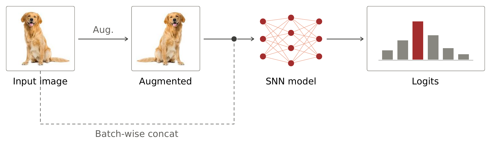
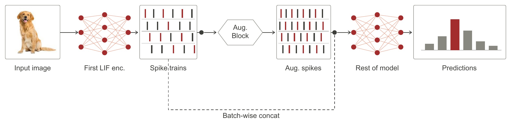

# Pre- and Post-Encoding Augmentations in Spiking Neural Networks

Master's thesis, University of Hildesheim.

This repository contains the code for the thesis *Pre- and Post-Encoding
Augmentations in Spiking Neural Networks*. The work studies data augmentation
for spiking neural networks (SNNs) at two stages of the pipeline. Pre-encoding
augmentations act on the raw image or binned event tensor before the spiking
encoder. Post-encoding augmentations act on the spike feature tensor of shape
`(T, B, C, H, W)` that the encoder produces. The main backbone is the
Spike-Driven Transformer (SDT) and MS-ResNet is used as a second spiking
backbone.

## Abstract

Spiking neural networks (SNNs) promise low-energy computation, since their
neurons communicate with sparse binary spikes rather than dense continuous
values. Most research on SNNs has gone into closing the accuracy gap with
conventional deep networks, while data augmentation, a routine part of training
standard networks, has had far less attention. It matters even more for SNNs,
where any extra spike activity an augmentation adds works against the energy
savings that make the model worth using.

This thesis studies augmentation for SNNs along three axes: accuracy, robustness
to common corruptions, and spike sparsity as a proxy for energy. We group
methods by where they act. Pre-encoding methods change the raw image or binned
event tensor before the encoder; post-encoding methods change the spike tensor
the encoder produces. We adapt augmentations from the image and vision
transformer literature, including PatchShuffle, PatchDropout, PatchMix and
several temporal operations, and add methods built for the spike setting such as
Frequency Encoding, Hole Fill denoising, a binary ClassMix, and FullDimensionMix
for event data. All are tested on static image and neuromorphic benchmarks with
two backbones.

Most patch and temporal methods transfer to the spike setting and give small but
steady accuracy gains over a strong baseline, while removing augmentation lowers
accuracy and robustness sharply. Corruption-focused image methods give the
largest robustness gains on static data but can damage neuromorphic accuracy,
where temporal methods are safer. Gains are clearer for the transformer backbone
than for the residual one. The safe choice depends on both the data type and the
backbone.

## Pipeline

Pre-encoding augmentations act on the input before the spiking encoder:



Post-encoding augmentations act on the spike trains produced by the first
spiking encoder, then feed the augmented spikes to the rest of the model:



## Methods

Pre-encoding (applied to the input image or binned event tensor before the
spiking encoder):

- PatchShuffle
- PatchDropout
- PatchMix
- IPMix
- LayerMix
- RSM (random spike masking, via the Masked Spiking Transformer variant)

Post-encoding (applied to the spike feature tensor of shape `(T, B, C, H, W)`
after the encoder):

- TimeShuffle
- TimeMask
- TimeMix
- Local TimeShuffle
- Temporal Jitter
- FullDimensionMix (PAPMix)
- CenterPatch MinLift
- Frequency Encoding
- Class Batch Mix (binary ClassMix)
- Hole Fill Spatial
- Hole Fill SpatioTemporal
- PatchShuffle (post-encoding)
- PatchDropout (post-encoding)
- PatchMix (post-encoding)

Method names here match the rows of the results table below and the tables in
the thesis.

## Repository structure

- `Spike-Driven-Transformer/`: main codebase, with the full set of pre- and
  post-encoding augmentations on the SDT backbone.
- `MS-ResNet/`: the same study applied to the MS-ResNet spiking backbone. Each
  augmentation is a self-contained module under `models/`.
- `Spike-Driven-Transformer-timeshuffle/`: variant that isolates TimeShuffle,
  which permutes the spike tensor along the time axis `T`.
- `Spike-Driven-Transformer-sameclass/`: variant that isolates Class Batch Mix,
  a binary ClassMix that mixes across the batch when a batch is single-class and
  across time steps otherwise, keeping the output spikes binary.
- `Spike-Driven-Transformer-neighbouring0sto1s/`: variant that isolates Hole
  Fill denoising, which flips an isolated `0` to `1` when all eight spatial
  neighbours are `1`.
- `Spike-Driven-Transformer-rsm/`: variant that isolates RSM (random spike
  masking), built on the Masked Spiking Transformer.

Each code folder shares a common layout. `model/` and `module/` hold the network
definition, `conf/` holds YAML configuration files, `dvs_utils/` holds helpers
for the event-based datasets, `train.py` is the training entry point,
`criterion.py` and `data.py` define the loss and the data loading, and
`firing_num.py` and `plot_spike_ratio.py` handle spike-rate analysis.

## Where the methods live

Direct links to representative implementations on the SDT backbone:

- PatchShuffle: [`train-patchshuffle.py`](Spike-Driven-Transformer/train-patchshuffle.py), post-encoding [`train-patchshuffle-postencoding.py`](Spike-Driven-Transformer/train-patchshuffle-postencoding.py)
- PatchDropout: [`train-patchdropout.py`](Spike-Driven-Transformer/train-patchdropout.py), post-encoding [`train-patchdropout-postencoding.py`](Spike-Driven-Transformer/train-patchdropout-postencoding.py)
- PatchMix: [`train-patchmix.py`](Spike-Driven-Transformer/train-patchmix.py), post-encoding [`train-patchmix-postencoding.py`](Spike-Driven-Transformer/train-patchmix-postencoding.py)
- LayerMix: [`layermix.py`](Spike-Driven-Transformer/layermix.py), training [`train-layermix-github.py`](Spike-Driven-Transformer/train-layermix-github.py)
- IPMix: [`train-ipmix.py`](Spike-Driven-Transformer/train-ipmix.py), mixing set [`mixing_set_ipmix.py`](Spike-Driven-Transformer/mixing_set_ipmix.py)
- Frequency Encoding: [`frequency_encoding_aug.py`](Spike-Driven-Transformer/frequency_encoding_aug.py), training [`train-frequencyencoding.py`](Spike-Driven-Transformer/train-frequencyencoding.py)
- Local TimeShuffle: [`localtimeshuffle.py`](Spike-Driven-Transformer/localtimeshuffle.py)
- Temporal Jitter: [`train-temporaljitter.py`](Spike-Driven-Transformer/train-temporaljitter.py)
- CenterPatch MinLift: [`train-center-patch-aug.py`](Spike-Driven-Transformer/train-center-patch-aug.py)

On the MS-ResNet backbone, each method is a single module under
[`MS-ResNet/models/`](MS-ResNet/models), for example
[`holefill.py`](MS-ResNet/models/holefill.py),
[`classbatchmix.py`](MS-ResNet/models/classbatchmix.py),
[`timeshuffle2d.py`](MS-ResNet/models/timeshuffle2d.py),
[`timemask.py`](MS-ResNet/models/timemask.py) and
[`frequency_encoding_aug.py`](MS-ResNet/models/frequency_encoding_aug.py).

## Setup

```bash
git clone https://github.com/manub14/Master-Thesis.git
cd Master-Thesis/Spike-Driven-Transformer

python3 -m venv .venv
source .venv/bin/activate
pip install -r requirements.txt
```

Install PyTorch for your own CUDA or CPU setup by following the instructions at
https://pytorch.org/get-started/locally/. The spiking layers use `spikingjelly`.

Place the datasets under a local `data/` folder, which is ignored by git.

## Running

Training is driven by `train*.py` with a YAML config from `conf/` plus a set of
command-line flags. The dataset is chosen with `--dataset`, the backbone with
`--model`, the spiking neuron with `--spike-mode`, the number of time steps with
`--time-steps`, and the augmentation by the specific `train-<method>.py` entry
point (with a `--use-<method>` flag where present).

A representative run, five-seed LayerMix on CIFAR-100 with the SDT backbone:

```bash
ROOT=/media/homes/bist/Spike-Driven-Transformer
CFG=$ROOT/conf/cifar100/2_512_300E_t4.yml
DATA=./data
OUT=/media/homes/bist/output/train
SEEDS=(1276641137 232203868 357165756 61166289 736646900)

for s in "${SEEDS[@]}"; do
  EXP="layermix_cifar100_sdt_t4_lif_seed${s}"
  CUDA_VISIBLE_DEVICES=7 python "$ROOT/train-layermix-github.py" \
    -c "$CFG" \
    --model sdt \
    --spike-mode lif \
    --data-dir "$DATA" \
    --img-size 32 \
    --in-channels 3 \
    --num-classes 100 \
    --time-steps 4 \
    --train-split train \
    --val-split test \
    --dataset torch/cifar100 \
    --use-layermix \
    --mixing-set /path/to/mixing_set/fractals_and_fvis \
    --seed "$s" \
    --experiment "$EXP" \
    -b 64 \
    --output "$OUT"
done
```

Swap `train-layermix-github.py` and its flags for another `train-<method>.py`
to run a different augmentation. IPMix and LayerMix additionally need a
`--mixing-set` directory of fractal and feature-visualisation images.

## Results

Numbers below are on CIFAR-100 (clean top-1 accuracy) and CIFAR-100-C
(corruption top-1 accuracy), averaged over seeds. The full set of datasets and
metrics is reported in the thesis. **Bold** marks the best value in each column.

Removing augmentation is costly: on the SDT backbone, dropping it takes clean
accuracy from 78.40 to 68.39 and corruption accuracy from 52.94 to 30.76.
Temporal methods such as TimeMask and Class Batch Mix hold the highest clean
accuracy while lifting robustness, whereas the corruption-focused image methods
IPMix and LayerMix win on robustness but trade away clean accuracy. On the
MS-ResNet backbone the gains are smaller and noisier, and IPMix is the clearest
winner on both axes.

### Spike-Driven Transformer

| Method | CIFAR-100 | CIFAR-100-C |
| --- | --- | --- |
| Baseline (standard augmentation) | 78.40 | 52.94 |
| No augmentation | 68.39 | 30.76 |
| PatchShuffle | 78.78 | 49.70 |
| PatchMix | 79.29 | 52.14 |
| PatchDropout | 78.67 | 51.61 |
| RSM | 76.13 | 48.49 |
| LayerMix | 72.64 | 55.39 |
| IPMix | 74.43 | **58.30** |
| TimeShuffle | 79.45 | 53.24 |
| TimeMix | 78.69 | 51.82 |
| TimeMask | **79.56** | 53.39 |
| PatchShuffle (post-encoding) | 78.44 | 51.80 |
| PatchMix (post-encoding) | 78.99 | 52.20 |
| PatchDropout (post-encoding) | 78.93 | 52.29 |
| CenterPatch MinLift | 79.15 | 52.76 |
| FullDimensionMix (PAPMix) | 78.80 | 52.67 |
| Class Batch Mix | 79.38 | 53.34 |
| Hole Fill Spatial | 79.06 | 52.72 |
| Hole Fill SpatioTemporal | 79.17 | 53.02 |
| Frequency Encoding | 78.40 | 51.50 |
| Temporal Jitter | 78.90 | 53.01 |
| Local TimeShuffle | 79.15 | 52.70 |

### MS-ResNet

| Method | CIFAR-100 | CIFAR-100-C |
| --- | --- | --- |
| Basic augmentation | 62.05 | 32.88 |
| No augmentation | 57.10 | 24.82 |
| PatchShuffle | 62.20 | 34.70 |
| PatchMix | 54.74 | 35.76 |
| PatchDropout | 63.90 | 26.15 |
| RSM | 59.47 | 26.12 |
| LayerMix | 59.94 | 30.54 |
| IPMix | 63.72 | **48.48** |
| Class Batch Mix | 59.53 | 33.55 |
| Hole Fill Spatial | 62.03 | 26.88 |
| Hole Fill SpatioTemporal | **64.92** | 29.88 |
| Frequency Encoding | 60.54 | 33.28 |
| Temporal Jitter | 62.55 | 32.73 |
| Local TimeShuffle | 60.70 | 24.10 |
| CenterPatch MinLift | 63.18 | 30.08 |
| FullDimensionMix (PAPMix) | 61.30 | 29.47 |
| PatchShuffle (post-encoding) | 53.65 | 27.05 |
| PatchDropout (post-encoding) | 59.83 | 29.84 |
| PatchMix (post-encoding) | 61.51 | 35.72 |
| TimeShuffle (post-encoding) | 63.42 | 27.39 |
| TimeMask (post-encoding) | 62.07 | 22.41 |
| TimeMix (post-encoding) | 61.94 | 20.42 |
| Hole Fill (post-encoding) | 64.92 | 24.90 |

## Citation

<!-- Confirm the author spelling and add a DOI or university-repository URL once
     the thesis is deposited, then delete this comment. -->

```bibtex
@mastersthesis{bist2026preandpostencoding,
  title   = {Pre- and Post-Encoding Augmentations in Spiking Neural Networks},
  author  = {Manu Singh Bist},
  school  = {University of Hildesheim},
  year    = {2026},
  type    = {MSc thesis}
}
```

## Acknowledgements

- The Spike-Driven Transformer backbone builds on the work of Yao et al.,
  *Spike-driven Transformer* (NeurIPS 2023):
  https://github.com/BICLab/Spike-Driven-Transformer
- The MS-ResNet backbone builds on the work of Hu et al., *Advancing Spiking
  Neural Networks Toward Deep Residual Learning* (IEEE TNNLS 2024):
  https://github.com/Ariande1/MS-ResNet
- Spiking neuron models are provided by the `spikingjelly` library.
- IPMix and LayerMix use fractal and feature-visualisation mixing sets from the
  respective original augmentation papers.
